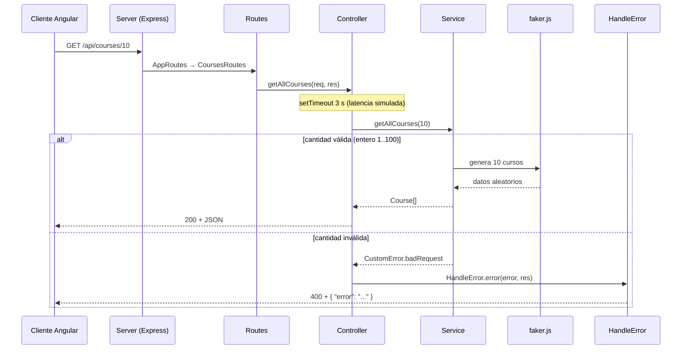

# 📘 Documentación técnica del backend — Server-NodeJS

Documentación técnica general del servidor del taller **Client-Server (Angular + Node.js)** de la asignatura Arquitectura de Software.

## Tabla de contenido

1. [Propósito y alcance](#1-propósito-y-alcance)
2. [Stack y versiones](#2-stack-y-versiones)
3. [Estructura de carpetas y capas](#3-estructura-de-carpetas-y-capas)
4. [Flujo de una petición](#4-flujo-de-una-petición)
5. [Variables de entorno](#5-variables-de-entorno)
6. [Endpoints](#6-endpoints)
7. [Modelos de datos](#7-modelos-de-datos)
8. [Manejo de errores](#8-manejo-de-errores)
9. [Uso de faker.js](#9-uso-de-fakerjs)
10. [Documentación Swagger](#10-documentación-swagger)
11. [Comportamientos a tener en cuenta](#11-comportamientos-a-tener-en-cuenta)
12. [Guía para agregar un módulo nuevo](#12-guía-para-agregar-un-módulo-nuevo)

---

## 1. Propósito y alcance

El backend es la parte **servidor** de la arquitectura cliente-servidor del taller. Expone una **API REST** que el cliente Angular (`Client-Angular`) consume por HTTP.

- No usa base de datos: todos los datos se **generan aleatoriamente con faker.js** en cada petición.
- Solo expone operaciones de lectura (`GET`).
- Tiene cinco módulos: `users` y `products` (base del docente) y `courses`, `orders` y `books` (agregados en este taller).
- Publica su documentación interactiva con Swagger en `/api/docs`.
- Sirve una página estática de bienvenida desde la carpeta `public/`.

## 2. Stack y versiones

Versiones tomadas de `package.json`:

| Tecnología | Versión | Uso |
|---|---|---|
| Node.js + TypeScript | TypeScript 5.9.3 | Lenguaje y entorno de ejecución |
| Express | 5.2.1 | Framework HTTP |
| cors | ^2.8.5 | Habilita CORS para que el cliente (puerto 4200) pueda consumir la API |
| dotenv | 17.2.3 | Carga las variables del archivo `.env` |
| env-var | 7.5.0 | Valida y tipa las variables de entorno |
| swagger-jsdoc | ^6.2.8 | Genera la especificación OpenAPI a partir de comentarios JSDoc |
| swagger-ui-express | ^5.0.1 | Muestra la interfaz de Swagger |
| @faker-js/faker | 10.1.0 | Generación de datos aleatorios |
| ts-node-dev | 2.0.0 | Ejecución en desarrollo con recarga automática |

Comando de ejecución (`package.json`):

```bash
npm run start    # tsnd --respawn --clear src/app.ts
```

## 3. Estructura de carpetas y capas

```
Server-NodeJS/
├── .env                          # PORT y PUBLIC_PATH
├── package.json · tsconfig.json
├── docs/
│   └── DOCUMENTACION_TECNICA.md  # este documento
├── public/
│   └── index.html                # página de bienvenida
└── src/
    ├── app.ts                    # punto de entrada
    ├── config/
    │   ├── envs.ts               # lectura y validación de variables de entorno
    │   ├── swagger.ts            # configuración de swagger-jsdoc
    │   └── swagger.schemas.ts    # schemas OpenAPI (User, Product, Error, Course, Order, Book)
    ├── domain/
    │   ├── erros/                # CustomError y HandleError
    │   └── interfaces/           # modelos: user, product, course, order, book, server
    └── presentation/
        ├── server.ts             # clase Server (middlewares, rutas, swagger, SPA)
        ├── routes.ts             # AppRoutes: registra los módulos bajo /api
        └── modules/
            ├── users/            # users.routes.ts · users.controller.ts · users.service.ts
            ├── products/
            ├── courses/
            ├── orders/
            └── books/
```

Responsabilidad de cada capa:

| Capa | Responsabilidad |
|---|---|
| `config` | Configuración transversal: variables de entorno y Swagger. |
| `domain` | Modelos de datos (interfaces) y errores de la aplicación. No depende de Express salvo `HandleError`. |
| `presentation` | Todo lo relacionado con HTTP: servidor, rutas, controladores y servicios de cada módulo. |

Cada **módulo** sigue siempre el mismo patrón de tres archivos:

| Archivo | Rol |
|---|---|
| `x.routes.ts` | Define la ruta HTTP y su documentación `@openapi`. |
| `x.controller.ts` | Recibe la petición, llama al servicio y arma la respuesta HTTP. |
| `x.service.ts` | Contiene la lógica: validar la cantidad y generar los datos con faker. |

## 4. Flujo de una petición



Orden de middlewares en `Server.start()`:

1. `cors()` — permite peticiones desde otros orígenes.
2. `express.json()` — parseo de cuerpos JSON.
3. `express.static(publicPath)` — archivos estáticos de `public/`.
4. `this.routes` — rutas de la API (`/api/...`).
5. `/api/docs` — Swagger UI.
6. Fallback: cualquier otra ruta responde `public/index.html`.

## 5. Variables de entorno

Definidas en `.env` y validadas en `src/config/envs.ts` con `env-var`:

| Variable | Obligatoria | Valor por defecto | Descripción |
|---|---|---|---|
| `PORT` | Sí | — | Puerto del servidor (`asPortNumber()`); en el proyecto: `3000` |
| `PUBLIC_PATH` | No | `public` | Carpeta de archivos estáticos |

Si `PORT` falta o no es un puerto válido, `env-var` lanza un error al arrancar.

## 6. Endpoints

Todas las rutas usan el método **GET** y reciben la cantidad de elementos a generar como parámetro de ruta.

| Módulo | URL | Parámetro | Respuesta OK | Error |
|---|---|---|---|---|
| Users | `/api/users/{countUsers}` | entero | `201` + `User[]` | — |
| Products | `/api/products/{countProducts}` | entero | `201` + `Product[]` | — |
| Courses | `/api/courses/{countCourses}` | entero 1..100 | `200` + `Course[]` | `400` |
| Orders | `/api/orders/{countOrders}` | entero 1..100 | `200` + `Order[]` | `400` |
| Books | `/api/books/{countBooks}` | entero 1..100 | `200` + `Book[]` | `400` |

Ejemplos reales de respuesta (los valores cambian en cada llamada):

**`GET /api/courses/2`**
```json
[
  { "id": 1, "name": "Fisica Mecanica", "teacher": "Alyssa Ankunding IV", "credits": 1, "modality": "Hibrido" },
  { "id": 2, "name": "Calculo Diferencial", "teacher": "Esther Mertz", "credits": 3, "modality": "Virtual" }
]
```

**`GET /api/orders/2`**
```json
[
  { "id": 1, "customer": "Omar Hilpert", "total": 251.95, "status": "Enviado", "date": "2026-08-27T09:43:30.122Z" },
  { "id": 2, "customer": "Ira Strosin PhD", "total": 434.19, "status": "Pendiente", "date": "2026-09-06T04:34:24.555Z" }
]
```

**`GET /api/books/2`**
```json
[
  { "id": 1, "title": "U.S.A. Trilogy", "author": "Michael Chabon", "genre": "Ciencia Ficcion", "year": 1987, "pages": 205 },
  { "id": 2, "title": "Mrs. Dalloway", "author": "Nathanael West", "genre": "Ciencia Ficcion", "year": 2019, "pages": 597 }
]
```

**`GET /api/books/101`** → `400`
```json
{ "error": "countBooks debe ser un entero entre 1 y 100" }
```

## 7. Modelos de datos

Definidos en `src/domain/interfaces/`.

| Modelo | Archivo | Campos |
|---|---|---|
| `User` | `user.interface.ts` | `id: number`, `name: string`, `lastName: string`, `age: number`, `email: string`, `engineering: UserEngineering` |
| `Product` | `product.interface.ts` | `id: number`, `name: string`, `category: ProductCategory`, `price: number` |
| `Course` | `course.interface.ts` | `id: number`, `name: string`, `teacher: string`, `credits: number`, `modality: CourseModality` |
| `Order` | `order.interface.ts` | `id: number`, `customer: string`, `total: number`, `status: OrderStatus`, `date: string` (ISO 8601) |
| `Book` | `book.interface.ts` | `id: number`, `title: string`, `author: string`, `genre: BookGenre`, `year: number`, `pages: number` |

Tipos enumerados (unión de literales, **sin tildes**, igual que el proyecto base):

| Tipo | Valores |
|---|---|
| `UserEngineering` | `Sistemas`, `Electronica`, `Biomedica`, `Industrial`, `Ambiental` |
| `ProductCategory` | `Lacteos`, `Carnes`, `Frutas`, `Verduras` |
| `CourseModality` | `Presencial`, `Virtual`, `Hibrido` |
| `OrderStatus` | `Pendiente`, `Enviado`, `Entregado`, `Cancelado` |
| `BookGenre` | `Ciencia Ficcion`, `Fantasia`, `Historia`, `Tecnologia` |

Además, `server.interface.ts` define `Options` (`port`, `publicPath`, `routes`) usada por la clase `Server`.

## 8. Manejo de errores

Se centraliza en `src/domain/erros/`:

- **`CustomError`** extiende `Error` y agrega `statusCode`. Ofrece métodos estáticos: `badRequest` (400), `unAuthorized` (401), `forbidden` (403), `notFound` (404), `conflict` (409) e `internalServer` (500).
- **`HandleError.error(error, res)`** escribe el error en consola y responde:
  - Si es un `CustomError`: `statusCode` del error y cuerpo `{ "error": "<mensaje>" }`.
  - Cualquier otro error: `500` y `{ "error": "Internal Server error" }`.

Los servicios de los módulos nuevos validan la cantidad solicitada y lanzan `CustomError.badRequest(...)`; el controlador la captura en el `.catch(...)` de la promesa y delega en `HandleError`.

Validación aplicada (módulos `courses`, `orders`, `books`): `Number.isInteger(cantidad) && cantidad >= 1 && cantidad <= 100`. Casos que devuelven `400`: `abc`, `0`, `-1`, `2.5`, `101`.

## 9. Uso de faker.js

Cada servicio genera datos con `@faker-js/faker`. Los identificadores (`id`) son consecutivos de 1 a N.

| Módulo | Campo | Método de faker |
|---|---|---|
| Users | `name` | `faker.person.firstName()` |
| Users | `lastName` | `faker.person.lastName()` |
| Users | `age` | `faker.number.int({ min: 18, max: 65 })` |
| Users | `email` | `faker.internet.email()` |
| Users | `engineering` | `faker.helpers.arrayElement(...)` |
| Products | `name` | `faker.commerce.productName()` |
| Products | `price` | `faker.commerce.price({ min: 1, max: 100, dec: 2 })` |
| Products | `category` | `faker.helpers.arrayElement(...)` |
| Courses | `name` | `faker.helpers.arrayElement(courseNames)` |
| Courses | `teacher` | `faker.person.fullName()` |
| Courses | `credits` | `faker.number.int({ min: 1, max: 4 })` |
| Courses | `modality` | `faker.helpers.arrayElement(modalities)` |
| Orders | `customer` | `faker.person.fullName()` |
| Orders | `total` | `faker.commerce.price({ min: 10, max: 500, dec: 2 })` |
| Orders | `status` | `faker.helpers.arrayElement(statuses)` |
| Orders | `date` | `faker.date.recent({ days: 30 }).toISOString()` |
| Books | `title` | `faker.book.title()` |
| Books | `author` | `faker.book.author()` |
| Books | `genre` | `faker.helpers.arrayElement(genres)` |
| Books | `year` | `faker.number.int({ min: 1950, max: 2025 })` |
| Books | `pages` | `faker.number.int({ min: 80, max: 900 })` |

## 10. Documentación Swagger

- **URL:** <http://localhost:3000/api/docs> (con el servidor encendido).
- **Cómo funciona:** `src/config/swagger.ts` usa `swagger-jsdoc` y lee los comentarios `@openapi` de:
  - `src/presentation/modules/**/*.routes.ts` → cada endpoint (ruta, parámetros y respuestas).
  - `src/config/swagger.schemas.ts` → los schemas reutilizables (`User`, `Product`, `Error`, `Course`, `Order`, `Book`).
- La especificación resultante (OpenAPI 3.0.0) la sirve `swagger-ui-express` en `/api/docs`.
- Cada endpoint se agrupa con un *tag* (`Users`, `Products`, `Courses`, `Orders`, `Books`) y documenta las respuestas `200` (o `201` en los módulos base) y `400`.

Cómo documentar un endpoint nuevo: agregar sobre el `router.get(...)` un bloque `/** @openapi ... */` (ver `courses.routes.ts` como plantilla) y agregar su schema en `swagger.schemas.ts` con `$ref: '#/components/schemas/<Nombre>'`.

> ⚠️ `swagger-jsdoc` resuelve las rutas `./src/...` **relativas a la carpeta desde donde se ejecuta el servidor**, por eso `npm run start` debe ejecutarse dentro de `Server-NodeJS/`.

## 11. Comportamientos a tener en cuenta

- **Latencia simulada:** cada controlador espera **3 segundos** (`setTimeout`) antes de responder. Sirve para que el cliente muestre su estado de carga. Se aplica también a las respuestas de error.
- **CORS abierto:** `cors()` sin restricciones (adecuado para desarrollo).
- **Fallback SPA:** cualquier ruta no definida devuelve `public/index.html` con código `200` (incluidas rutas `/api/...` inexistentes).
- **Status en módulos base:** `users` y `products` responden `201` en el `GET`, mientras Swagger documenta `200`. Los módulos nuevos responden `200` y coinciden con Swagger.
- **Validación en módulos base:** `GET /api/users/abc` devuelve `[]` (no valida la cantidad). Los módulos nuevos sí devuelven `400`.
- **Datos volátiles:** al no haber base de datos, los datos cambian en cada petición.
- **faker en `devDependencies`:** funciona en desarrollo (`ts-node-dev`); si se compilara para producción habría que moverlo a `dependencies`.

## 12. Guía para agregar un módulo nuevo

Ejemplo con un módulo `things` (`Thing`):

1. **Modelo:** crear `src/domain/interfaces/thing.interface.ts` con la interfaz `Thing` y sus tipos enumerados (valores sin tildes) y TSDoc en español.
2. **Servicio:** crear `src/presentation/modules/things/things.service.ts` con `getAllThings(countThings)`: validar el rango con `CustomError.badRequest`, generar los datos con faker en un método privado `generateThing(id)` y devolver `Promise<Thing[]>`.
3. **Controlador:** crear `things.controller.ts` con la propiedad flecha `getAllThings`, que lee `req.params`, llama al servicio y responde con `res.status(200).json(...)`, delegando errores en `HandleError.error`.
4. **Rutas:** crear `things.routes.ts` con la clase `ThingsRoutes` (`static get routes(): Router`), el `router.get("/:countThings", ...)` y el bloque `@openapi` (tag, parámetro, respuestas `200` y `400`).
5. **Registro:** en `src/presentation/routes.ts`, importar `ThingsRoutes` y agregar `router.use("/api/things", ThingsRoutes.routes);`.
6. **Schema Swagger:** agregar el schema `Thing` en `src/config/swagger.schemas.ts`.
7. **Verificar:** `npx tsc --noEmit`, iniciar el servidor, probar `GET /api/things/5` (200) y `GET /api/things/abc` (400) y revisar `/api/docs`.
8. **Cliente:** crear en Angular la interfaz, el servicio (`api/things/${count}` **sin barra inicial**), la tabla, la página, la ruta, el enlace del navbar y las pruebas Jest.
9. **Commit:** `feat(server): agregar módulo things con datos de faker`.
